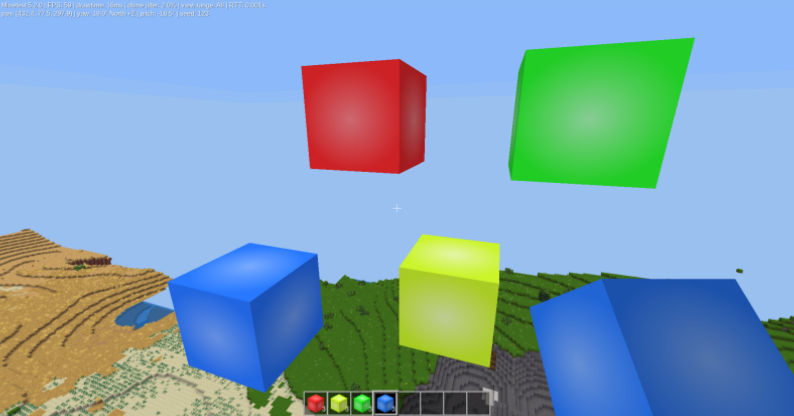
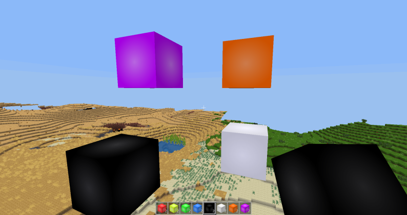
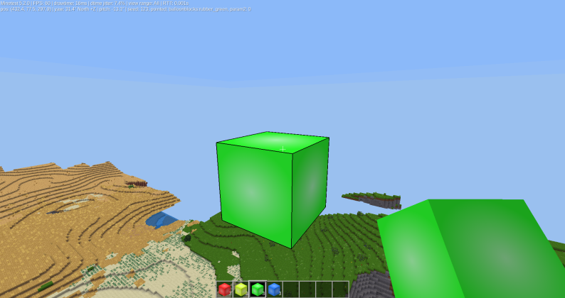
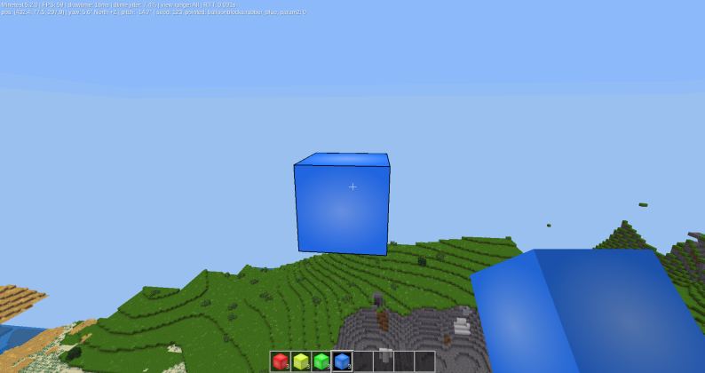
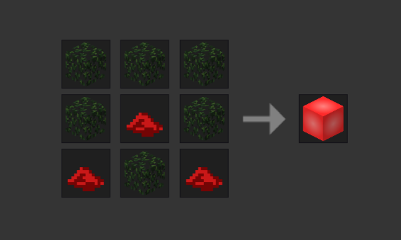

# Balloonblocks

A mod that adds balloon blocks which can be placed on air.

## Description

Have you ever wanted to build a big house in the sky?

But you can't because it would take ages to build up from the ground.

Now you can!

The balloonblocks can be placed on air, this means there is no more trouble getting a block up in the sky.

When placing a balloonblock in the air it is always placed three blocks away.

That means it is an efficient way to build a path in the sky (if you don't have fly).

You can just jump onto one height above your current height or the same height.

But, if you can fly, then you don't have to build up.

You can just fly up and place a balloonblock!

Documentation todo list:

* Add details to the change log section with version details.
* Contributing needs a reference to contributing guidlines.
* Add a brief intro to yourself under the Author heading. Make sure you get approval before pushing to github.
* Licensing needs a quick reference to the MIT license.

## Installing

There are three ways to install the balloonblocks mod:

### Minetest GUI Installation

You can do it without closing the game.

Click on the tab titled "Content".
* Then at the bottom click on "Browse online content" (it may take a while).
* After that search for "balloon".
* Find the one called "Balloonblocks".
* On the right of it there will be "install".
* Click on that.
* It will say "Downloding and installing Balloonblocks".

You have now installed Balloonblocks.

### Zip File Installation

* Use the website [ContentDB](https://content.minetest.net/packages/?q=balloonblocks)
* Find the one titled Balloonblocks, then click on it.
* After that find a green button titled "Download" click on it.
* Then click ok on the box that comes up.
* Now open files.
* Next go to downloads and right click on it.
* Go to the top one and right click on it.
* Find "Extract to".
* Click on that and go to "Home".
* Then right click on an empty space and find "Show hidden files".
* Click on it, then find ".minetest".
* Double click on that.
* Then find "mods".
* If you don't have one alredy then make one, but it has to be "mods" exactly or it won't work.
* Then double click on it.
* Click "Select".
* Next take the same path as you did before (Home-.minetest-mods).
* And finaly rename it to minetest-balloon-blocks.

You have now installed Balloonblocks

### Git Installation

* Use the website [ContentDB](https://content.minetest.net/packages/?q=balloonblocks).
* Find the one titled Balloonblocks.
* Then click on it.
* After that find "Source" it is near the bottom of the screenshot.
* Click on that.
* Then find "Clone or download".
* Click on it.
* Open a command line.
* Type in "cd .minetest".
* Then "cd mods".
* Then "git clone " but before you press enter right click on the screen.
* Find "Paste", click on it
* Now press enter
* It will say "Cloning into minetest-balloon-blocks"

You have now installed Balloonblocks

## Crafting

This is how to craft them and what they look like

### Red 

### Yellow

### Green

### Blue

## Change Log

## Contributing

## Author

## License
